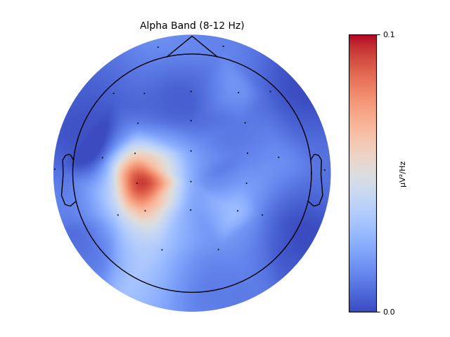
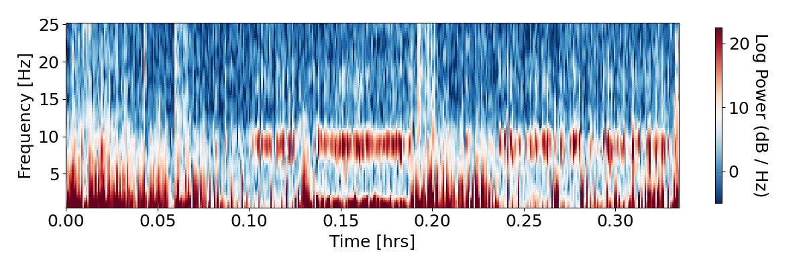

# tool-neuropraxpy
This is a CLI (command line interface) tool to read binary files from NEURO PRAX (.EEG/.EE_ files) and parse them into Python dictionaries. Python wraps a module of MATLAB scripts for converting the binary files to .mat format. The hard work was done for me. Functionality is currently limited to Windows. If there is a bug, please raise an Issue.

Note: the repository is ~2.14 GB in size. Please give it time to clone/download and extract. You're downloading all the Octave libraries without actually installing it. 

Please follow the instructions below.

# Installation

#### 1. Download Repository ####

1) Git clone this repository to your machine OR download the ZIP folder and extract the files (recommend downloading the ZIP!)
2) Pip install the package into your python environment

# Usage

#### 1. Convert Binary Files To Pickle (for Python) ####

NOTE: This tool only works for .EEG and .EE_ files from NEURO PRAX. The folder in which you run the CLI must have at least one .EEG file with a .EE_ of the same name.

1) Open a command prompt or Anaconda Prompt (whatever you used to pip install) in the folder of your .EEG/.EE_ files
2) Run the command `neuropraxpy`
3) Observe the command prompt for any warnings and watch the progress bar fill up
4) When finished, there will be two new folders next to the .EEG/.EE_ files. "Eingelegt" contains FOUR .pickle files ***for each .EEG file***, one for each data format (info, data, and marker) and a fourth file with all three in one "_NP__info_data_marker". The original name of the .EEG file is preserved, e.g. `20211014163727_NP__info_data_marker.pickle`

*Hint, "eingelegt" means "pickled" in German*

#### 2. Loading Data Into Python ####

1) In your python script, you can use functions from this package to load your data into python:
```
import os
from neuropraxpy.reader.load import pickle_jar, load_pickle

# set the working directory to the folder with the pickle files
os.chdir(r"C:\path\to\pickle\files\eingelegt")
# get all the pickled data files
pickles = pickle_jar()
# pick one to load
eeg_data = load_pickle(pickles[0])

# select the EEG data
channels = eeg_data['info']['channels'][:-1] # drop the DTRIG channel
channel_idx = channels.index('Cz') # pick a channel
eeg = eeg_data['data']['data'][:,:-1] # drop here too
sf=eeg_data['info']['fa'][0][0] # get the sampling rate

# notch filter
freqs = (50, 100, 150, 200)
notched = mne.filter.notch_filter(np.float64(eeg.T).copy(), sf, 
        freqs, 
        method='fir', 
        phase='zero-double', 
        trans_bandwidth=5)

# visualize a spectrogram
yasa.plot_spectrogram(notched[0,:], sf, win_sec=3)
plt.tight_layout()


# do something with MNE
import mne
from mne.viz.topomap import plot_psds_topomap, _prepare_topomap_plot

mne_info = mne.create_info(ch_names=list(channels), sfreq=sf, ch_types='eeg')
epochs = mne.EpochsArray(notched[np.newaxis,...], mne_info)
epochs.set_channel_types({'VN': 'eog','VP': 'eog','HN': 'eog','HP': 'eog','VN': 'eog','Cerv7': 'ecg'})
epochs.set_montage(mne.channels.make_standard_montage('standard_1020'))
picks, pos, merge_channels, names, ch_type, sphere, clip_origin = \
    _prepare_topomap_plot(epochs, 'eeg', sphere=None)
outlines = mne.viz.topomap._make_head_outlines(sphere, pos, 'head', clip_origin)

plt.figure(figsize=(12,8))
epochs.plot_psd_topomap(ch_type='eeg', normalize=True, bands=[(8, 12, 'Alpha Band (8-12 Hz)')], 
        tmin=1, tmax=5, axes=[plt.gca()], outlines='head', vlim=(0, 0.1), cmap='seismic')
```




2) You now have a variable called `eeg_data` that contains dictionaries of key:values similar to a MATLAB struct. I would recommend using Spyder to have a variable explorer.

# Future Releases
Hosting this tool on the web would be cool. The only setback would be file upload/download times. This setback seems to be a greater cost than the user installing the repository once and having much faster usage going forward.

